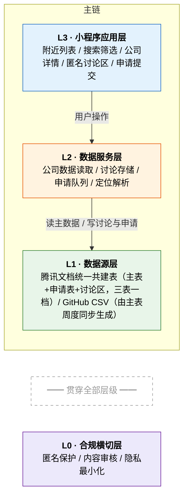
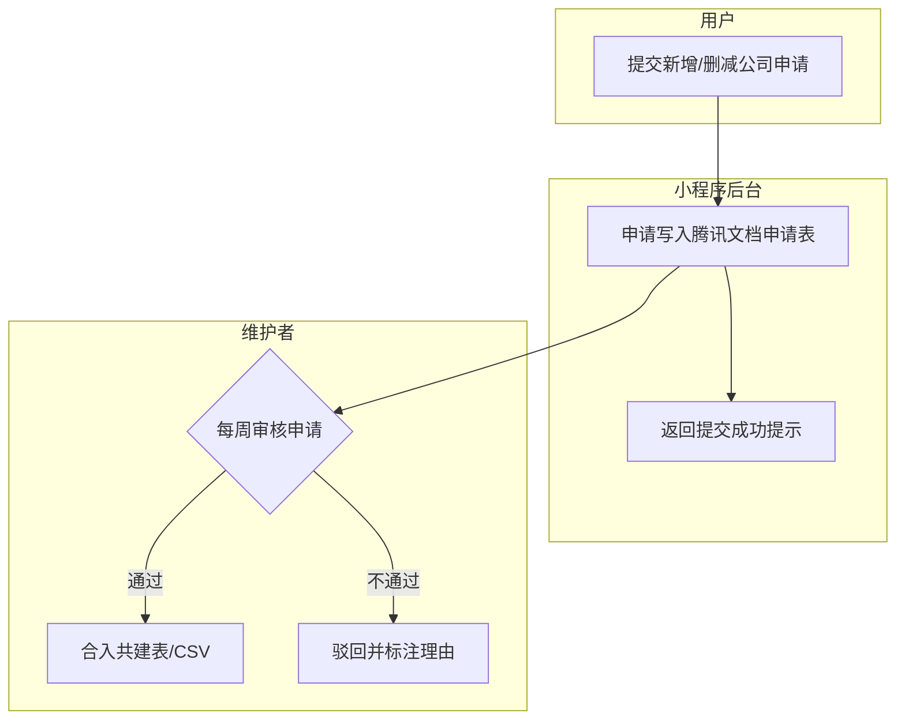
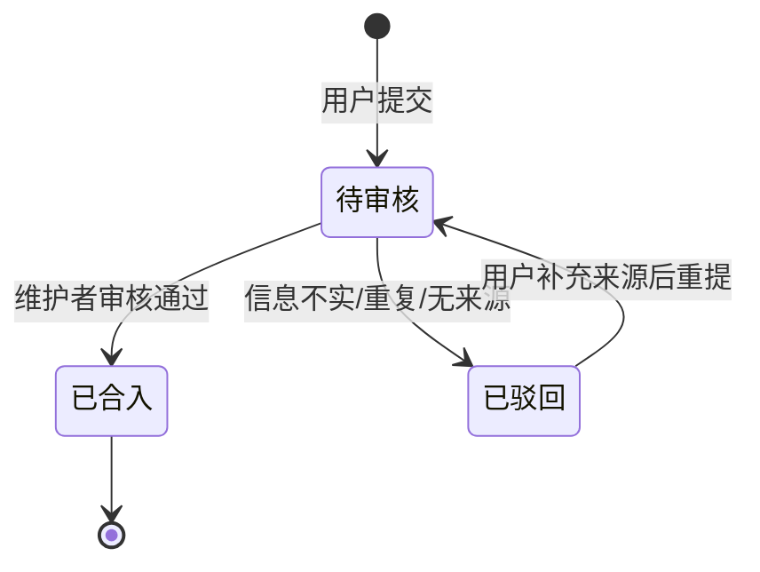
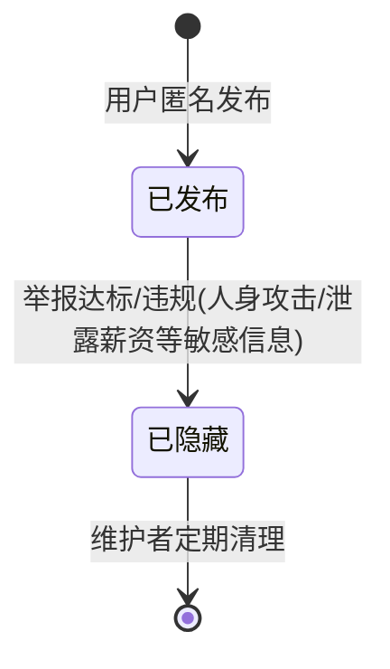

# 产品需求文档: 休着 · 双休公司查询小程序

**创建时间**: 2026-09-09
**状态**: 已定稿（三项拍板 + 统一表格架构确认，待开工）
**版本**: v2.1(典型增强版)

## 输入历史 (Input History)

> 本章节按时间顺序记录驱动本 PRD 演进的所有原始用户输入,作为需求来源的可追溯凭据。**请勿删除或改写已有条目**,新输入一律追加到末尾。

### 2026-09-09 16:13 · Generate · 初始需求
**模式**: generate
**触发**: 首次创建 PRD
**原始输入**:
> ok 这两部可以的 记得也放进GitHub方便别人拿去填写 记得设置权限公开
>
> 配上。另外这个项目开发一个微信小程序版本，数据还是这些，允许用户对某个公司补充讨论形成匿名讨论表（放公司详情里吧），用户可以提交增加或删减公司申请，后台用腾讯文档直接对接这些申请数据和已有数据，默认显示附近公司列表，可以加定位查询附近的双休公司，或修改定位看其他位置的公司。先找产品经理skill分析这个事情还有哪些需求点，整理出来给我评估。主要针对目前热门讨论的大家都去买双休公司产品这块。

---

### 2026-09-09 16:47 · Clarify · 三项拍板+自动化时段偏好
**模式**: clarify
**问题**: 三个未决问题（审核操作台/讨论数据落地/公司坐标）如何拍板？
**原始回答**:
> PII 拦截是什么，不合规吗这个项目？
> 审核就先腾讯文档。讨论也放腾讯文档、公司坐标加经纬度吧，或者类似快递地址那样精确到省市区级别

---

## 端形态矩阵

| 端 | 角色 | 核心动作 | 是否本期 | 备注 |
|----|------|----------|----------|------|
| 微信小程序（C端） | 普通用户 | 附近公司查询 / 详情查看 / 匿名讨论 / 提交增删申请 | 是 | 本期唯一交付端 |
| 腾讯文档共建表（后台） | 维护者+社区 | 申请数据落地 / 已有数据维护 / 定期合入 GitHub | 是 | 已上线，本轮对接 |
| GitHub 仓库 + Pages | 公众/开发者 | 数据开源下载 / Web 查询 / PR 补充 | 是 | 已上线，小程序数据源 |

## 产品架构与核心流程图

### 产品架构图（分层架构）

### 申请处理流程（泳道图）

### 公司申请状态机

### 讨论内容状态机

## 用户场景与测试

### 用户故事 1 - 定位看附近的双休公司 (P1)

求职者小王周末想换工作，打开小程序，自动定位到所在城市/区，看到附近有哪些公司是双休的，按距离排序浏览，点开详情看休息制度、请假难度、加班情况和大家的讨论。

**优先级原因**: 这是产品核心价值——"大家都去买双休公司产品"的热点讨论下，用户最基础的需求是"我家附近有哪些双休公司"。定位是小程序相对网页版（GitHub Pages）的差异化能力。

**独立测试**: 打开小程序授权定位 → 显示附近公司列表 → 点任一公司看详情，全程无需其他操作。

**验收场景**:
1. 首次打开小程序并授权定位 → 默认展示 5km 内公司列表，按距离由近到远排序
2. 拒绝定位授权 → 引导手动选择城市，同样可浏览（不给死路）
3. 修改定位城市为"上海" → 列表切换为上海的公司，距离字段显示为"—"或按区中心估算
4. 筛选"仅双休" → 列表只显示休息制度为双休/上四休三的公司

---

### 用户故事 2 - 公司详情 + 匿名讨论区 (P1)

用户点开某公司详情页，看到结构化信息（城市/行业/规模/休息制度/请假难度/加班情况），下方是匿名讨论区：在职/离职员工可以补充"某某部门实际是大小周"等一线信息，形成公司维度的讨论串。

**优先级原因**: 网页版只有静态数据，小程序的核心增值就是**公司详情内的匿名讨论**——这正是"双休公司概念股"热点下，用户验证"名单上这家公司是不是真的双休"的关键信息来源。

**独立测试**: 进入详情页 → 匿名发表一条讨论 → 讨论即时显示在列表中，不显示任何身份信息。

**验收场景**:
1. 在讨论框输入文字发布 → 立即显示在讨论列表，头像为系统随机默认头像，无昵称无身份
2. 讨论内容含手机号/身份证号 → 发布前提示"请勿包含个人隐私信息"并拦截
3. 点击"举报" → 该讨论进入维护者审核队列，达 3 人举报自动隐藏
4. 详情页展示讨论数 → 如"讨论 12 条"，用户可先判断热度再进入

---

### 用户故事 3 - 提交新增/删减公司申请 (P2)

用户发现某公司不在库中（或名单有误），填写申请表（公司名/城市/休息制度/请假难度/来源），提交后写入腾讯文档申请表，由维护者每周审核合入。

**优先级原因**: 数据生长靠用户，但为了避免垃圾数据污染主库，走"申请→审核→合入"而不是直接写主数据。

**独立测试**: 提交一条新增申请 → 腾讯文档申请表中出现该记录 → 维护者审核后主库出现该公司。

**验收场景**:
1. 提交新增申请（含公司名+城市+休息制度）→ 提示"已提交，审核通过后会显示在列表中"，申请写入腾讯文档
2. 提交删减申请 → 需必填"删减理由"（如已倒闭/实测单休），写入申请表并标记原记录
3. 提交含空必填项 → 表单校验拦截并高亮缺失项
4. 同一用户短时间内重复提交相同公司+城市 → 提示"该公司申请已在审核中"，防灌水

---

### 用户故事 4 - 按公司/行业搜索 (P2)

用户不想靠定位，直接搜"字节"或"半导体"看相关信息，支持关键词匹配公司名/行业/备注。

**优先级原因**: 与网页版对齐的基础能力，保证两端体验一致。

**独立测试**: 搜索框输入"字节" → 返回所有公司名含"字节"的记录。

**验收场景**:
1. 输入"字节" → 秒级返回匹配结果列表
2. 无匹配结果 → 显示空态文案"没有找到，去提交申请补充这家公司"+ 申请入口按钮

---

### 边界情况

- **定位失败/超时**：fallback 到手动选城市，不阻塞主流程
- **无网络**：展示缓存的公司列表 + "网络异常"提示
- **讨论区灌水/机器人**：同一 openid 每日讨论上限 10 条；首次发布弹确认框
- **恶意删减申请**（把竞对公司都申请删掉）：删减申请必须给理由+可选来源，审核环节人工拦截
- **数据同步延迟**：小程序展示的数据注明"最后更新：YYYY-MM-DD"，管理维护者周更
- **热点流量峰值**（"双休公司概念股"热点期）：公司列表分页加载，讨论区分页，避免一次全量拉取

## 认证与账号体系

本产品**无传统登录注册**，基于微信 openid 静默标识：

- **AUTH-001**: 系统通过微信 openid 静默标识用户，无需用户感知登录过程
- **AUTH-004**: 会话随小程序生命周期管理，无长期会话存储敏感凭证
- **AUTH-006**: 申请提交、讨论发布等写操作须校验 openid 频控，未通过返回明确提示
- **AUTH-007**: **个人信息最小化**：不采集昵称/头像/手机号；讨论强制匿名（不关联可读身份）；定位仅取城市/区粒度用于查询，**不存储精确经纬度**；用户可随时在"我的"页申请删除自己发过的讨论

> 无密码找回/多设备同步等场景，AUTH-002/003/005 不适用，已裁剪。

## 需求

### 功能需求

**附近与列表**
- **FR-001**: 首页默认基于定位展示附近公司列表（距离排序），支持手动切换城市
- **FR-002**: 支持按休息制度（双休/大小周/单休/上四休三）筛选
- **FR-003**: 支持按公司名/行业关键词搜索

**公司详情与讨论**
- **FR-004**: 公司详情页展示 CSV 全字段（公司/城市/区/行业/规模/休息制度/请假难度/加班情况/核实时间/备注/来源）
- **FR-005**: 详情页内嵌匿名讨论区，支持发布/分页浏览/举报
- **FR-006**: 讨论强制匿名：不展示昵称头像，仅显示相对时间（如"3 天前"）

**申请通道**
- **FR-007**: 提交"新增公司"申请，必填：公司名/城市/休息制度；选填：区/行业/规模/请假难度/来源链接/备注
- **FR-008**: 提交"删减公司"申请，必填：删减理由；写入腾讯文档申请表并关联原公司
- **FR-009**: 所有申请写入腾讯文档申请表（与共建表分表），供维护者周度审核

**数据与后台**
- **FR-010**: 公司主数据以 GitHub CSV 为源（小程序侧缓存），展示"最后更新时间"
- **FR-011**: 维护者审核通过后，经已有周度同步链路（共建表→CSV→GitHub Pages）自然生效，小程序端下次拉取即更新

### 关键实体

- **公司 (Company)**: 名称/城市/区/行业/规模/休息制度/请假难度/加班情况/来源/核实时间/备注；唯一键 = 公司名+城市
- **讨论 (Discussion)**: 关联公司ID/匿名内容/发布时间/状态（已发布/已隐藏）
- **申请 (Application)**: 类型（新增/删减）/目标公司/变更内容/理由/来源/提交时间/状态（待审核/已合入/已驳回）

### 核心实体状态机

见上方"核心实体状态机"章节（公司申请状态机 + 讨论内容状态机）。

## 成功标准

- **SC-001**: 新用户从打开小程序到看到附近双休公司列表 ≤ 3 步操作、10 秒内
- **SC-002**: 上线 1 个月内，≥ 30 家公司拥有 ≥ 1 条匿名讨论（讨论渗透率）
- **SC-003**: 上线 1 个月内，用户提交增/删申请 ≥ 50 条，其中经审核合入 ≥ 20 条
- **SC-004**: 讨论区隐私违规（含手机号等 PII）拦截率 100%
- **SC-005**: 每周日同步后，小程序数据与 GitHub CSV 一致率 100%

## 优先级 (MoSCoW)

| 编号 | 需求 | Must / Should / Could / Won't(本期) |
|------|------|--------------------------------------|
| FR-001 | 定位附近列表+城市切换 | Must |
| FR-004 | 公司详情页 | Must |
| FR-005 | 匿名讨论区 | Must |
| FR-007/008 | 增/删申请提交 | Must |
| FR-009 | 申请落腾讯文档 | Must |
| FR-002 | 制度筛选 | Should |
| FR-003 | 关键词搜索 | Should |
| FR-006 | 讨论相对时间展示 | Should |
| FR-010/011 | 数据源同步+更新时间展示 | Should |
| — | 讨论点赞/回复楼中楼 | Won't(本期) |
| — | 用户个人主页/历史 | Won't(本期) |
| — | iOS 独立 App | Won't(本期) |

## 验收标准表

| FR 编号 | 验收条件(可测试、可判定) |
|---------|--------------------------|
| FR-001 | 授权定位后 ≤2s 出列表；拒绝授权后可手动选城市完成同等浏览 |
| FR-004 | 详情页字段与 CSV 中该行完全一致 |
| FR-005 | 发布讨论 ≤2s 可见；3 人举报自动隐藏 |
| FR-007 | 必填项缺失时无法提交且高亮提示 |
| FR-009 | 任一申请提交后 ≤1min 在腾讯文档申请表可见 |
| FR-010 | 详情页显示与数据同步日期一致的"最后更新" |

## 假设

- 用户量级假设首发期 ≤1万 DAU，讨论量 ≤千级/月（验证途径：上线后看小程序数据助手）
- "双休公司概念股"热点带来一波自然流量，热点期需扛突发（验证途径：上线时间可蹭热点话题）
- 维护者每周日审核一次申请即可满足时效（与已有周度同步自动化对齐）
- 公司坐标数据：首发期用**城市/区中心坐标**估算距离，不追求门店级精度（验证途径：用户反馈距离不准的比例）

## 超出范围

- 讨论区的点赞/回复/楼中楼（一期纯平铺讨论串）
- 公司评分/打分体系
- 站内私信
- 薪资爆料（合规风险高，明确不做）
- 小程序支付/会员

## Clarifications

### Session 2026-09-09
- Q: PII 拦截是什么？项目不合规吗？ → A: PII=个人身份信息（手机号/身份证等）。拦截**不等于项目不合规**，恰恰相反：讨论区用户随手贴出他人手机号/身份证会直接违反《个人信息保护法》，做拦截是为了让项目合规。合规设计三件套：讨论强制匿名、定位只存省市区、不采集昵称头像
- Q: 三个未决问题如何拍板？ → A: ①审核用腾讯文档（零开发）；②讨论数据也放腾讯文档；③公司坐标精确到省市区级别（类似快递地址，不做门店级经纬度）
- Q: 小程序后台与 GitHub 开源是否共用一套表格？ → A: **是**。统一为一份腾讯文档三张分表（主表 Z9Jl0h / 申请表 ucvytl / 讨论区 69CvWH），GitHub CSV 由主表周度同步生成，数据汇集单入口，无重复维护
